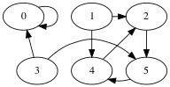
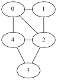
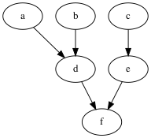

# Lecture: Graphs and Topological Sorting

The standard mathematical way to represent a graph G is with a set
of vertices V and a set of edges E, that is, G = (V,E).

In a *directed graph*, each edge is a pair of vertices where the first
vertex is called the source and the second is the target.

In an *undirected graph*, each edge is a set containing two distinct
vertices.
    
I often use n for the number of vertices and m for the number of
edges.

The set of vertices for this graph is 

    {0,1,2,3,4,5}.

The set of edges is 

    {(0,0), (1,2),(1,4),  (2,5),  (3,5),(3,0),  (4,2),  (5,4),  }.

Given edge (u,v) in a directed graph, we say v is *adjacent* to u.
We sometimes write u to v for the edge (u,v).

The edge (u,v) is an *out-edge* of u and an *in-edge* of v.

The *out-degree* of a vertex is the number of its out-edges.

The *in-degree* of a vertex is the number of its in-edges.

The set of vertices is `{0,1,2,3,4}`.

The set of edges is `{ {1,2},{1,0},  {2,3},{2,4},{2,0},  {3,4},  {4,0} }`.

We often writes an undirected edge as `(1,2)` or `1-2` instead of `{1,2}`.

Given edge `{u,v}` in an undirected graph, we say u and v are
*adjacent* to each other. 

We say that edge `{u,v}` is *incident on* vertex u and v.

The *degree* of a vertex is the number of edges incident on it.

## Adjacency List

The *Adjacency List* representation of a graph is an array of linked
lists.

Example: for the above directed graph the adjacency list
representation is

	 |0| -> 0
	 |1| -> 2 -> 4
	 |2| -> 5
	 |3| -> 0 -> 5
	 |4| -> 2
	 |5| -> 4

Example: for the above undirected graph the adjacency list
representation is

	 |0| -> 1 -> 2 -> 4
	 |1| -> 0 -> 2
	 |2| -> 1 -> 4 -> 3 -> 0
	 |3| -> 2 -> 4
	 |4| -> 0 -> 3 -> 2

(Each edge is stored twice.)

Adjacency lists are good for storing sparse graphs.

* Space: O(n + m).
* Edge detection given two vertices: O(n)
* Edge insert: O(1)
* Edge removal given two vertices: O(n) 
* Edge remove given edge handle: O(1) if use double linked
* Edge removal: O(n) or O(1) if use double linked and edge handle
* Vertex insert: amortized O(1)
* Vertex delete: not easily supported

## Adjacency Matrix

The *Adjacency Matrix* representation of a graph is a Boolean matrix.

Example, for the directed graph above.

	  0 1 2 3 4 5
	0 1 0 0 0 0 0
	1 0 0 1 0 1 0
	2 0 0 0 0 0 1
	3 1 0 0 0 0 1
	4 0 0 1 0 0 0
	5 0 0 0 0 1 0

Example, for the undirected graph above.

	  0 1 2 3 4
	0 0 1 1 0 1
	1 1 0 1 0 0
	2 1 1 0 1 1
	3 0 0 1 0 1
	4 1 0 1 1 0

Note that the matrix is symmetric.

Adjacency matrices are good for dense graphs.

* Space: O(n²)
* Edge detection given two vertices: O(1)
* Edge insert: O(1)
* Edge removal given two vertices: O(1)
* Edge remove given edge handle: O(1)
* Edge removal: O(1)
* Vertex insert: amortized O(1)
* Vertex delete: not easily supported

How could we represent Adjacency Matrices in Java?

## Topological sorting

Makefile example for building software
(a) zig.cpp
(b) boz.h
(c) zag.cpp
(d) zig.o
(e) zag.o
(f) libzigzag.a

- Is this a well-formed dependence graph, are there any cycles?
- In what order should they be compiled?
- How many steps are required to compile everything in parallel?

Recall that a topological ordering is an ordering `A` of the vertices
such that if `A[i] -> A[j]`, then `i < j`.

In other words, a vertex needs to come before every other vertex
that depends on it.

Here are many (all?) of the topological orderings:

	a,b, c, d,e, f
	b,a, c, d,e, f
	a,b, c, e,d, f
	b,a, c, e,d, f
	a,b, d, c,e, f
	b,a, d, c,e, f
	c,e, a,b, d, f
	c,e, b,a, d, f

### Knuth's version of Kahn's algorithm for topological sort

	static <V> void topo_sort(Graph<V> G, 
							  Consumer<V> output,
							  Map<V,Integer> num_pred) {
		// initialize the in-degrees to zero
		for (V u : G.vertices()) {
			num_pred.put(u, 0);
		}
		// compute the in-degree of each vertex
		for (V u : G.vertices())
			for (V v : G.adjacent(u))
			num_pred.put(v, num_pred.get(v) + 1);

		// collect the vertices with zero in-degree
		LinkedList<V> zeroes = new LinkedList<V>();
		for (V v : G.vertices())
			if (num_pred.get(v) == 0)
			zeroes.push(v);

		// The main loop outputs a vertex with zero in-degree and subtracts
		// one from the in-degree of each of its successors, adding them to
		// the zeroes bag when they reach zero.
		while (zeroes.size() != 0) {
			V u = zeroes.pop();
			output.accept(u);
			for (V v : G.adjacent(u)) {
			num_pred.put(v, num_pred.get(v) - 1);
			if (num_pred.get(v) == 0)
				zeroes.push(v);
			}
		}
	}

Time Complexity of Topological Sort (Knuth's version)

1. Compute in-degrees

	Outer loop processes every vertex: O(n)

	Outer + inner loop processes every edge: O(m)

	Total: O(n + m)

2. Collect vertices with zero in-degree: O(n)

3. Main loops (while + for) processes each edge just once: O(m)

Total: O(n + m) or because m in O(n²), total is O(n²).

### Student Exercise 

topologically sort the following graph

	V = { belt, jacket, pants, socks, shoes, shirt, tie, undershorts, watch }

	E = { belt -> jacket,
		  pants -> shoes, pants -> belt,
		  socks -> shoes,
		  shirt -> tie, shirt -> belt,
		  tie -> jacket,
		  undershorts -> pants, undershorts -> shoes }

solution: (one of many)

	socks, undershorts, pants, shoes, watch, shirt, belt, tie, jacket
